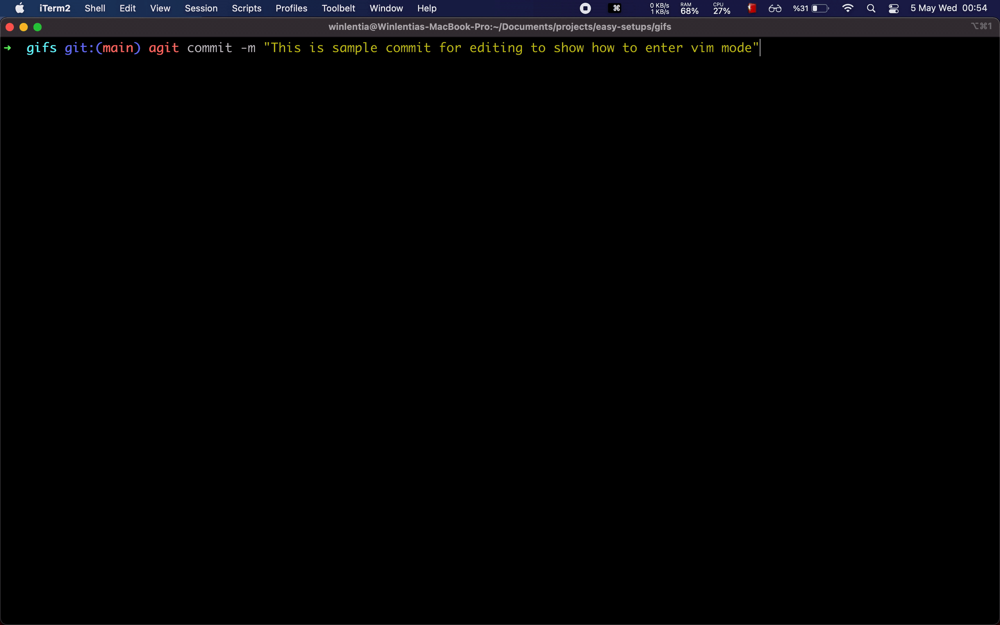

## Macos Setup
- [Applications](#applications)
- [Configurations](#configurations)
- [Bash Terminal](#bash-terminal)
---

### Applications
[back to top](#readme)</br>
Chrome ( https://www.google.com/chrome/ )</br>
Xcode ( https://developer.apple.com/download/more/?=xcode )</br>
VSCode ( https://code.visualstudio.com/ )</br>
Spectacle ( https://www.spectacleapp.com )</br>
Flycut ( https://github.com/TermiT/Flycut/releases )</br>
MagicPref ( http://magicprefs.com )</br>
iTerm2 ( https://iterm2.com/ ) </br>
---

### Configurations
[back to top](#readme)
Trackpad > Point & Click -> tap to click</br>
Trackpad > More Gestures -> App Expose</br>
Keyboard > Modify Keys > Caps Lock Key = Escape</br>
Keyboard > Text > uncheck ( Correct spelling, Capitalize words, add period with double space</br>
Dock & Menu Bar > Battery > Show Percentage </br>
---

### Bash Terminal
[back to top](#readme)
### Brew ( https://brew.sh/index )
```shell
    $ /bin/bash -c "$(curl -fsSL https://raw.githubusercontent.com/Homebrew/install/HEAD/install.sh)"
```
### OhMyZsh ( https://ohmyz.sh/#install ) 
```shell
# move oh-my-zsh to ~/.config/
$ sh -c "$(curl -fsSL https://raw.github.com/ohmyzsh/ohmyzsh/master/tools/install.sh)"
```
### ZshHighlighting ( https://github.com/zsh-users/zsh-syntax-highlighting/blob/master/INSTALL.md ) 
```shell
	# clone that repo in ~/.config/ folder
	git clone https://github.com/zsh-users/zsh-syntax-highlighting.git
	echo "source ${(q-)PWD}/zsh-syntax-highlighting/zsh-syntax-highlighting.zsh" >> ${ZDOTDIR:-$HOME}/.zshrc
```
### Tmux ( https://github.com/tmux/tmux/wiki )
```shell
	brew install tmux
```

### Stats - NavigationBar computer stats ( https://github.com/exelban/stats )
```shell
	brew install --cask stats
```
---

### Zshrc ( Learn from Luke Smith video https://www.youtube.com/watch?v=eLEo4OQ-cuQ )
Optimized for macos and oh my zsh's zshrc</br>

```shell
# If you come from bash you might have to change your $PATH.
# export PATH=$HOME/bin:/usr/local/bin:$PATH
export PATH=/opt/homebrew/bin:$PATH

# Path to your oh-my-zsh installation.
export ZSH="/Users/winlentia/.config/.oh-my-zsh"

ZSH_THEME="robbyrussell"

# Uncomment the following line to disable bi-weekly auto-update checks.
DISABLE_AUTO_UPDATE="true"

# Uncomment the following line to automatically update without prompting.
# DISABLE_UPDATE_PROMPT="true"

# Uncomment the following line to change how often to auto-update (in days).
export UPDATE_ZSH_DAYS=13

plugins=(git)

source $ZSH/oh-my-zsh.sh

# History in cache directory:
HISTSIZE=10000
SAVEHIST=10000
HISTFILE=~/.cache/zsh/history

# Basic auto/tab complete:
autoload -U compinit
zstyle ':completion:*' menu select
zmodload zsh/complist
compinit
_comp_options+=(globdots)		# Include hidden files.

# vi mode
bindkey -v
export KEYTIMEOUT=1

# Use vim keys in tab complete menu:
bindkey -M menuselect 'h' vi-backward-char
bindkey -M menuselect 'k' vi-up-line-or-history
bindkey -M menuselect 'l' vi-forward-char
bindkey -M menuselect 'j' vi-down-line-or-history
bindkey -v '^?' backward-delete-char

# Change cursor shape for different vi modes.
function zle-keymap-select {
  if [[ ${KEYMAP} == vicmd ]] ||
     [[ $1 = 'block' ]]; then
    echo -ne '\e[1 q'
  elif [[ ${KEYMAP} == main ]] ||
       [[ ${KEYMAP} == viins ]] ||
       [[ ${KEYMAP} = '' ]] ||
       [[ $1 = 'beam' ]]; then
    echo -ne '\e[5 q'
  fi
}
zle -N zle-keymap-select
zle-line-init() {
    zle -K viins # initiate `vi insert` as keymap (can be removed if `bindkey -V` has been set elsewhere)
    echo -ne "\e[5 q"
}
zle -N zle-line-init
echo -ne '\e[5 q' # Use beam shape cursor on startup.
preexec() { echo -ne '\e[5 q' ;} # Use beam shape cursor for each new prompt.

# Use lf to switch directories and bind it to ctrl-o
lfcd () {
    tmp="$(mktemp)"
    lf -last-dir-path="$tmp" "$@"
    if [ -f "$tmp" ]; then
        dir="$(cat "$tmp")"
        rm -f "$tmp"
        [ -d "$dir" ] && [ "$dir" != "$(pwd)" ] && cd "$dir"
    fi
}
bindkey -s '^o' 'lfcd\n'

# Edit line in vim with ctrl-e:
autoload edit-command-line; zle -N edit-command-line
bindkey '^e' edit-command-line

source .config/zsh-syntax-highlighting/zsh-syntax-highlighting.zsh

bindkey '\e[A' history-beginning-search-backward
bindkey '\e[B' history-beginning-search-forward


```

### using vim in bash sample



### Vim cursor speed // todo 
.250 sec delay, 45 chars/sec</br>
```shell
xset r rate 250 45
```

## Nagivation stats

```shell
brew install --cask stats
```
## TheFuck

```shell
brew install thefuck
```

### git aliases

```shell
# ----------------------
# Git Aliases
# ----------------------
alias ga='git add'
alias gaa='git add .'
alias gaaa='git add --all'
alias gau='git add --update'
alias gb='git branch'
alias gbd='git branch --delete '
alias gc='git commit'
alias gcm='git commit --message'
alias gcf='git commit --fixup'
alias gco='git checkout'
alias gcob='git checkout -b'
alias gcom='git checkout master'
alias gcos='git checkout staging'
alias gcod='git checkout develop'
alias gd='git diff'
alias gda='git diff HEAD'
alias gi='git init'
alias glg='git log --graph --oneline --decorate --all'
alias gld='git log --pretty=format:"%h %ad %s" --date=short --all'
alias gm='git merge --no-ff'
alias gma='git merge --abort'
alias gmc='git merge --continue'
alias gp='git pull'
alias gpr='git pull --rebase'
alias gr='git rebase'
alias gs='git status'
alias gss='git status --short'
alias gst='git stash'
alias gsta='git stash apply'
alias gstd='git stash drop'
alias gstl='git stash list'
alias gstp='git stash pop'
alias gsts='git stash save'

# ----------------------
# Git Functions
# ----------------------
# Git log find by commit message
function glf() { git log --all --grep="$1"; }
```

